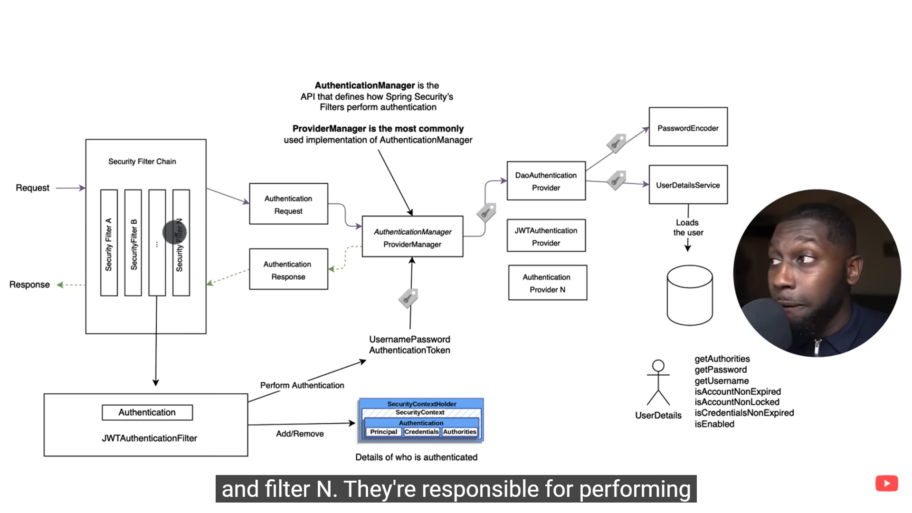
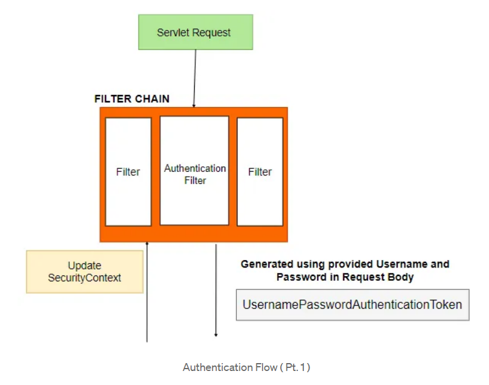
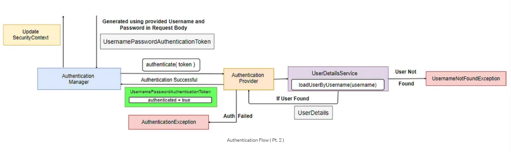

# Spring-Security
## Introduction
1. Spring Security is nothing but just bunch of servlet-filters like (UsernamePasswordAuthenticationFilter).
2. In General when we hit our API then the request is handled by the 'Dispatcher-Servlet' and then Dispacher-servlet will delegate
   the request to the corresponding controller so **No Authentication No Authorization** here i.e. anyone can use any of our API
   component w/o any restrictions.
3. So if we want to apply security in our API then we can use Spring-security by adding following dependency in our build.gradle -
```groovy
implementation 'org.springframework.boot:spring-boot-starter-security'
```
4. So by adding above dependency Spring will automatically configure few Components into our service.
   1. Default AuthenticationManager
   2. Default AuthenticationProvider
   3. Default LoginPage
5. For the default security the userName will be 'user' and the password will come in logs of application.
6. We can change the Default UserName and Password in following ways -
   ### 1. Application.yaml
   1. In aoolication.yaml file we can provide following config to change the default credes -
   ```yaml
    spring:
      security:
        user:
          name: ${userName:ayush}
          password: ${password:guptaji}
    ```
    2. But from here we can define only one user and even this approach is recommended only for testing not for 
       production ready code because we can't expose any creds in our code so that anyone will come and see
       them, although we are providing the values in environment variables but still not recommended.
   ### 2. InMemory User
   1. For login into our ecosystem to access our API's we create some users into our code itself by using
      '**UserDetailsService**' interface.
   2. So for that we need to create one bean into our configuration class for e.g. -
   ```
     @Bean
     public UserDetailsService userDetailsService() 
     {
        UserDetails user1 = User.withUsername(user1Name)
                              .password(passwordEncoder().encode(user1Pass))
                              .roles(user1Role)
                              .build();

        UserDetails user2 = User.withUsername(user2Name)
                        .password(passwordEncoder().encode(user2Pass))
                        .roles(user2Role)
                        .build();

        UserDetails user3 = User.withUsername(user3Name)
                        .password(passwordEncoder().encode(user3Pass))
                        .roles(user3Role)
                        .build();

        InMemoryUserDetailsManager inMemoryUserDetailsManager = new InMemoryUserDetailsManager();
        inMemoryUserDetailsManager.createUser(user1);
        inMemoryUserDetailsManager.createUser(user2);
        inMemoryUserDetailsManager.createUser(user3);

        return inMemoryUserDetailsManager;
     }
   
     @Bean
     public PasswordEncoder passwordEncoder() 
     {
       return new BCryptPasswordEncoder();
     }
   ```
   3. So here if you see we configured three user so now the application.yaml user creds will not work
      only above three users will work for login purpose.
   4. We can annotate our configuration class with '**@EnableWebSecurity**' to switch off the default web 
      application security configuration completely but this does not disable the authentication manager 
      configuration or Actuator’s security. but again this is Optional according to my knowledge bcz I 
      implemented my code w/o this annotation and it works absolutely fine but in documentation they were
      using that annotation.
   5. Here passwordEncoder() is a bean which will encrypt our password using '**BCryptPasswordEncoder()**'
      provided by the spring boot. We are not saving password directly into our memory.
   6. But again here if we see carefully then we can notice that we again expose some creds into our code, so this
      is again not advisable just use for testing purpose.
   ### 3. DB User
   1. Here instead of creating user creds into our code, we will fetch the creds directly from DB and authenticate
      them.
   2. For that like we have '**InMemoryUserDetailsManager**' class that implements 'UserDetailsService' interface
      for InMemory user we need to create one class which will implement 'UserDetailsService' interface and
      override the method '**loadUserByUsername(String username)**' which will fetch the userDetails from DB based
      on the userName provided by the endUser from login page.
   3. In our code '**UserSecurityInfoUserDetailsService**' class is doing that work for us.
   4. so after fetching the userDetails from DB we need to send it but the return type of method 
      'loadUserByUsername(String username)' is '**UserDetails**' and 'UserDetails' is an interface which provides
      'userName', 'password', 'roles or authorities' etc. to the authentication provider to authenticate the user.
   5. So we need to create another class which will implement 'UserDetails' interface, and we need to convert our
      object (contains userInfo. fetched from DB) type into that class.
   6. In our case '**UserSecurityInfoUserDetailsConverter**' is doing this.
   7. So to fetch Users from DB first we need to store them into our DB, so we need to create one separate controller
      to store the users into our DB.
   8. While storing userInfo into our DB we will not store password directly, we will encrypt it. Right now we are 
      using 'BCryptPasswordEncoder' for which we created one bean in our config bt we can use any other as well.
   9. If we use DB User then we need to create one bean for '**AuthenticationProvider**' in which we will provide
      the name of our 'userDetailsService' class and the 'passwordEncoder'.
   ```
   @Bean
   public AuthenticationProvider authenticationProvider() {
     DaoAuthenticationProvider daoAuthenticationProvider = new DaoAuthenticationProvider();
     daoAuthenticationProvider.setUserDetailsService(userDetailsService());
     daoAuthenticationProvider.setPasswordEncoder(passwordEncoder());
     return daoAuthenticationProvider;
   }
   ```

7. By Adding spring security dependency in our code by default security will be applied on each and every endpoint
   of the code (i.e. if we want to access any endpoint then we need to provide certain creds).
8. But if we want to customize it like creds should be provided for certain endpoints or for certain endpoints
   'RBAC (Role Based Access Control)' kind of functionalities we want to achieve then we need to create one bean
   '**SecurityFilterChain()**' in our configuration part of the project.
9. In the bean we can define configurations like which url we need to open for any user like public, for which URLs
   we need to allow **authentication** and for which URLs we need to enable RBAC. e.g.
```
    // For In-Memory user's Security config
    httpSecurity
        .csrf(AbstractHttpConfigurer::disable)
        .authorizeHttpRequests(
            (authorizeHttpRequests) ->
                authorizeHttpRequests
                    .requestMatchers("/security/demo/publicMethod")
                    .permitAll()
                    .requestMatchers("/DbUserHandling/createNewUser")
                    .hasRole(SecurityConstants.ROLE_HOKAGE)
                    .requestMatchers("/DbUserHandling/getAllUser")
                    .hasAnyRole(
                        SecurityConstants.ROLE_HOKAGE,
                        SecurityConstants.ROLE_JONIN,
                        SecurityConstants.ROLE_CHUNIN)
                    .requestMatchers("/security/demo/adminMethod")
                    .hasRole(SecurityConstants.ROLE_JONIN)
                    .anyRequest()
                    .authenticated())
        .formLogin(Customizer.withDefaults());
        
    // For DB user's Security config
        httpSecurity
            .csrf(AbstractHttpConfigurer::disable)
            .authorizeHttpRequests(
                (authorizeHttpRequests) ->
                    authorizeHttpRequests
                        .requestMatchers("/security/demo/publicMethod")
                        .permitAll()
                        .requestMatchers("/DbUserHandling/createNewUser")
                        .hasAuthority(SecurityConstants.ROLE_HOKAGE)
                        .requestMatchers("/DbUserHandling/getAllUser")
                        .hasAnyAuthority(
                            SecurityConstants.ROLE_HOKAGE,
                            SecurityConstants.ROLE_JONIN,
                            SecurityConstants.ROLE_CHUNIN)
                        .requestMatchers("/security/demo/adminMethod")
                        .hasAuthority(SecurityConstants.ROLE_JONIN)
                        .anyRequest()
                        .authenticated())
            .formLogin(Customizer.withDefaults());    
```
10. We have two configurations one is for In-Memory users and the other is for DB Users and the differnce b/w them
    is of only 'hasRole()' and 'hasAuthorith()' so let's understand the config and the difference -
      1. So first we disable the CSRF Attack (A very Common attack).
      2. Second we tell spring-boot that if you get any request then check if it matches --
         1. '/security/demo/publicMethod' then don't authenticate allow all the traffic.
         2. '/DbUserHandling/createNewUser' then authenticate the user (check login id and pass) and authorise the
            user with the 'HOKAGE' role (check user which logged in is HOKAGE or not if not then don't allow him).
         3. '/DbUserHandling/getAllUser' authenticate the user and check the corresponding allowed roles.
         4. '/security/demo/adminMethod' authenticate the user and check the role if 'JONIN' then allowed or else 
            NO.
         5. Apart from the above request if we get any request to our project then only **authenticate but not
            authorized it** like '/actuator'.
      3. So here if you see we use 'hasRole()' for memory and 'hasAuthority()' for DB but it's not like that we can
         use any syntax for anyone, only thing we need to take care is if we are using 'hasAuthority()' then we can
         store roles in our DB directly like 'HOKAGE', 'JONIN' etc. but when we use 'hasRole()' then we need to store
         our roles with prefix 'ROLE_' e.g. 'ROLE_HOKAGE', 'ROLE_JONIN'. because when we provide role values in our
         config then 'hasRole()' automatically append 'ROLE_' in the roles for checking internally but mostly
         'hasAuthority()' did n't if 'hasAuthority()' also do this but it handle everything internally so no need
         for us to take care of this.
11. In above configuration we have defined all the security related stuff but that's not the only way we can define  
    'Roles' or 'Authorities' directly on our API's itself. For that we need to follow below config -
```
 when we need to provide security on our API's Directly not from configuration.
 @Bean
  public SecurityFilterChain filterChain(HttpSecurity httpSecurity) throws Exception {
        httpSecurity                                          (for method level security)
            .csrf(AbstractHttpConfigurer::disable)
            .authorizeHttpRequests(
                (authorizeHttpRequests) -> authorizeHttpRequests.anyRequest().authenticated())
            .formLogin(Customizer.withDefaults());
            return httpSecurity.build();
  }
```
12. Apart from the above config we need to annotate our config class which contain 'SecurityFilterChain' bean with
    '**@EnableMethodSecurity**', after this we can apply security on method level in a follwong manner -
```
  @GetMapping("/adminMethod")
  @PreAuthorize("hasRole('Hokage')") or @PreAuthorize("hasAuthority('Role_Hokage')")      (for method level security)
  public ResponseEntity<?> adminUser() {
    return new ResponseEntity<>("Method for Admin User", HttpStatus.OK);
  }
```

## Flow Diagram of Spring Security (How it actually works)


1. First of all whenever our endpoints/API will be hit and spring security is enabled then the request will be 
   intercepted by the chain of Servlet filters or Authentication Filters in the filter chain instead of directly 
   intercept by the Dispatcher servlet.
   
2. Our input request will pass through every filter where one of the filter is 
   '**UsernamePasswordAuthenticationFilter**' which will generate a '**UsernamePasswordAuthenticationToken**'
   using the username and password provided by the user. The UsernamePasswordAuthenticationToken is an 
   implementation of the '**Authentication interface**' and used when a user wants to authenticate using a 
   username and password.
3. The '**UsernamePasswordAuthenticationToken**' is passed to the '**AuthenticationManager**' so that the token 
   can be authenticated.
   
4. The '**AuthenticationManager**' delegates the authentication to the appropriate '**AuthenticationProvider**'.
5.  The AuthenticationProvider calls the '**loadUserByUsername(username)**' method of the '**UserDetailsService**' 
    and gets back the '**UserDetails**' object containing all the data of the user. The most important data is the 
    password because it will be used to check whether the provided password is correct. If no user is found with 
    the given user name, a UsernameNotFoundException is thrown.
6. The AuthenticationProvider after receiving the UserDetails checks the passwords and authenticates the user. 
   FINALLY!!! . If the passwords do not match it throws a AuthenticationException. However, if the authentication 
   is successful, a '**UsernamePasswordAuthenticationToken**' is created, and the fields '**principal, credentials,
   and authenticated**' are set to appropriate values . Here principal refers to your username or the UserDetails ,
   credentials refers to password and the authenticated field is set to true. This token is returned back to the 
   AuthenticationManager.
7. On successful authentication, the '**SecurityContext**' is updated with the details of the current authenticated 
   user. SecurityContext can be used in several parts of the app to check whether any user is currently 
   authenticated and if so, what are the user’s details.

## IMP Links
1. https://medium.com/geekculture/spring-security-authentication-process-authentication-flow-behind-the-scenes-d56da63f04fa#:~:text=Step%202%20%3A%20A%20UsernamePasswordAuthenticationToken%20is,using%20a%20username%20and%20password.
2. https://medium.com/@er.rameshkatiyar/top-10-core-components-of-spring-security-52370be2c585
3. https://docs.spring.io/spring-boot/docs/2.0.0.M4/reference/html/boot-features-security.html#:~:text=If%20Spring%20Security%20is%20on,EnableGlobalMethodSecurity%20with%20your%20desired%20settings.
4. https://stackoverflow.com/questions/57247649/multiple-roles-using-preauthorize
5. https://reflectoring.io/complete-guide-to-csrf/ -- CSRF Attack
6. https://reflectoring.io/spring-csrf/ -- CSRF Protection in spring boot